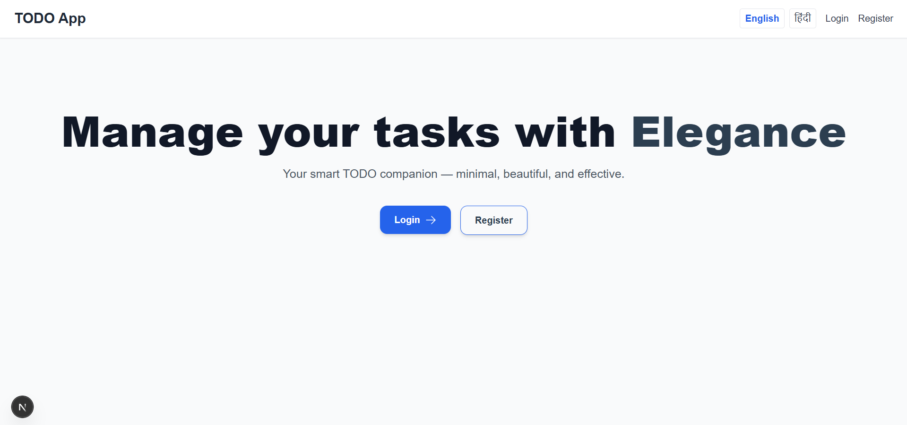
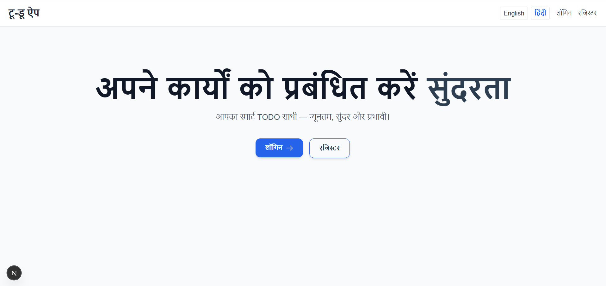
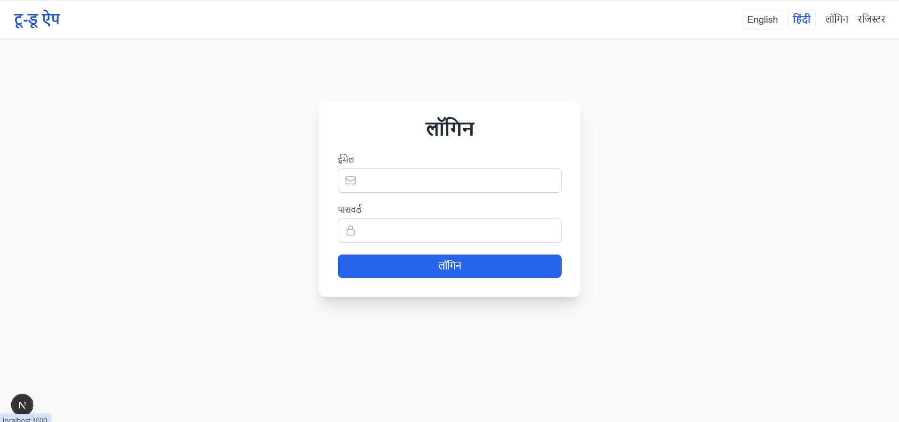
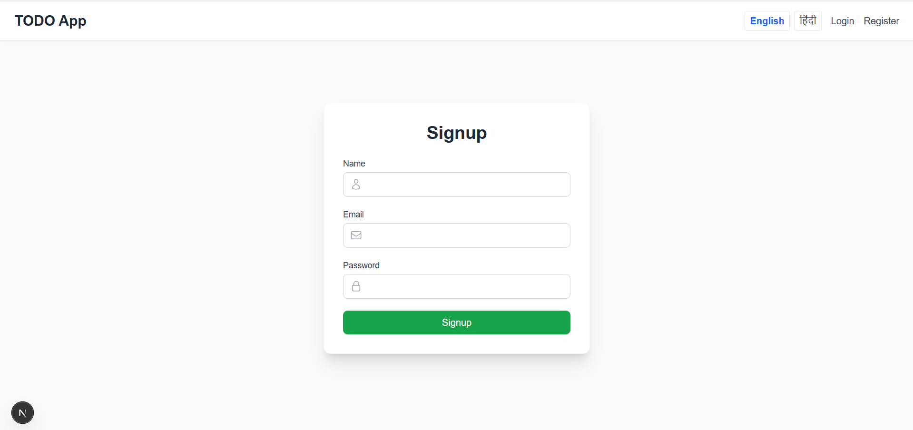
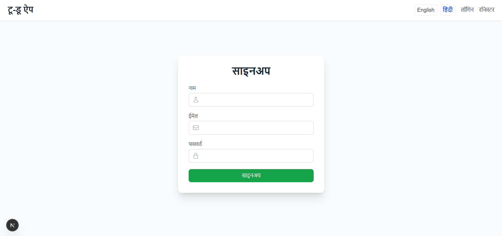
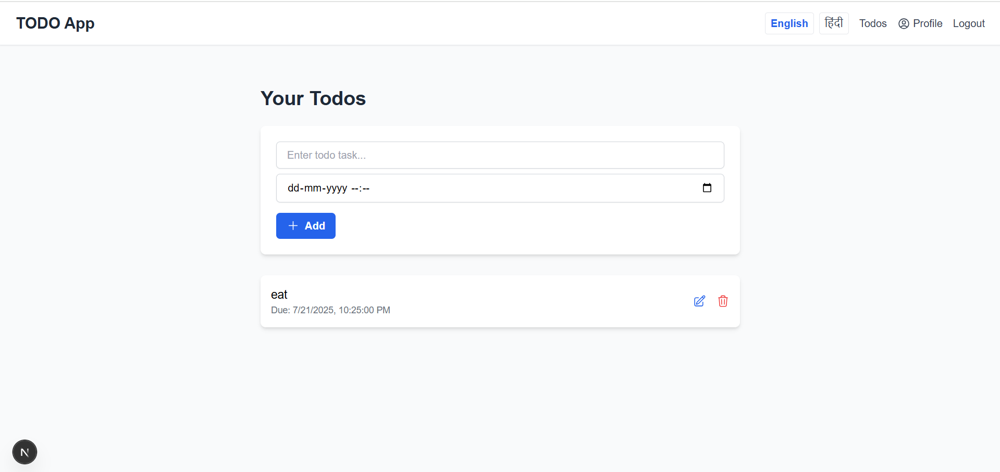
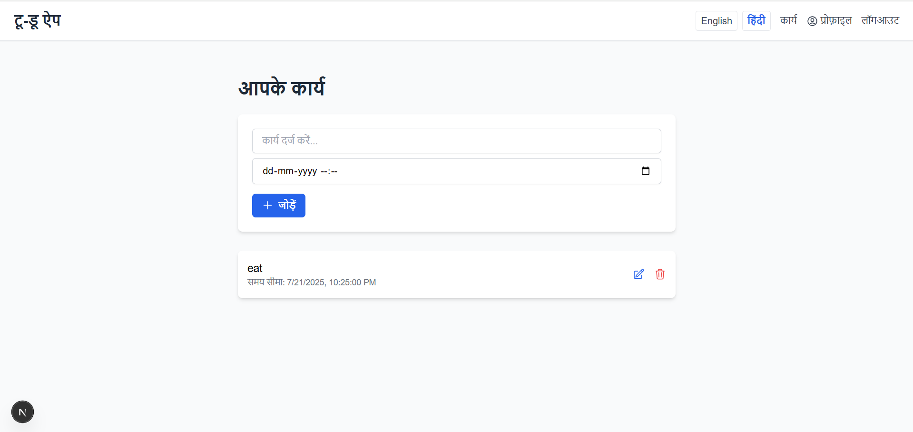
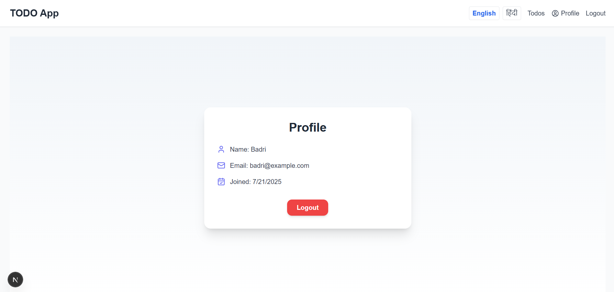
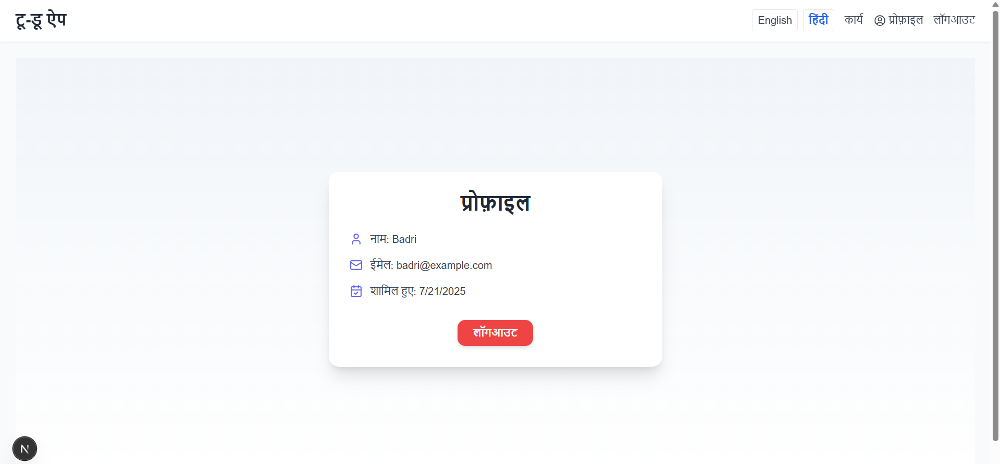

# 🌟 Full-Featured TODO App

A feature-rich, scalable TODO application built using **Next.js**, **React**, **TypeScript**, **Node.js**, **Express**, **JWT Authentication**, **Redux Toolkit**, and **i18n** (English + Hindi). It demonstrates modern full-stack development best practices, including SSR, state management, localization, reusable components, and protected routing.

---


## 📸 UI Screenshots

### 🏠 Home / Landing Page
>   
> 

### 🔐 Authentication (Login/Signup)
>   
> 
>   
> 

### ✅ TODO Dashboard
>   
> 

### Profile
>   
> 

---

## 📦 Tech Stack

### Frontend

- ⚛️ Next.js (App Router, SSR)
- 🧠 React 18 + TypeScript
- 🌍 i18n (English + Hindi) via `next-i18next`
- 🧾 Redux Toolkit (State Management)
- 💅 TailwindCSS (Styling)
- 🍪 JWT-based Auth (using Cookies)
- 🎯 React Hook Form + Zod (Validation)

### Backend

- 🖥️ Node.js + Express + TypeScript
- 🔒 JWT Authentication (Access + Refresh tokens)
- 📃 MongoDB with Mongoose
- 🧾 RESTful APIs for Auth, Menu, and TODOs

---

## 🔧 Features Implemented

### ✅ User Interface

- Dynamic navbar with menu items fetched from backend
- Conditional rendering based on login status
- Responsive premium UI with beautiful transitions

### ✅ TODO Module

- Add, edit, and delete TODO tasks
- SSR rendering of TODOs
- Central state with Redux Toolkit
- Task validation with due date, title, and status

### ✅ Reusable Form Component

- Shared component for create/edit TODO
- React Hook Form + Zod for validation
- Styled for reusability and accessibility

### ✅ Authentication

- Secure login/signup pages
- JWT-based authentication system
- Refresh token auto-renew mechanism
- Logout, session persistence, and role protection

### ✅ Protected Routes

- Only authenticated users can access `/dashboard`
- Server-side check for token validity
- Client-side redirect if unauthenticated

### ✅ Internationalization (i18n)

- Language files for English (`en`) and Hindi (`hi`)
- Language switcher in the navbar
- Instant UI updates on language change
- Persistent language setting using `localStorage`

### ✅ Backend API

- `POST /api/auth/signup`
- `POST /api/auth/login`
- `GET /api/menu`
- `GET /api/todos`
- `POST /api/todos`
- `PATCH /api/todos/:id`
- `DELETE /api/todos/:id`

---

## ⚙️ Setup Instructions

### 1. Clone the Repository

```bash
git clone https://github.com/BadriNath-2004/full_stack_todo_app.git
cd fullstack-todo-app

### 2. Setup Backend

cd backend
npm install
cp .env.example .env
# Fill in MONGO_URI, JWT_SECRET, etc.
npm run dev

### 3. Setup Frontend

cd frontend
npm install
cp .env.local.example .env.local
# Fill in NEXT_PUBLIC_API_URL and other envs
npm run dev

###Bonus Highlights
- MongoDB used with Mongoose for persistence ✅

- All secrets and tokens managed using .env ✅

- Global loading indicators and error boundaries ✅


###Assumptions & Improvements
- Auth token is stored in cookies for better SSR support.

- i18n is implemented using next-i18next, with scalable translation files.

- Menu items are fetched on every layout load to simulate dynamic nav.

- TODOs are user-specific and securely isolated.

- Can be extended to support notifications, tags, categories, etc.

###Learnings & Concepts
- JWT Flow with Refresh Tokens

- SSR in Next.js with secure APIs

- Managing localization at scale

- Structuring backend for multi-feature apps

- Real-world project folder structures
